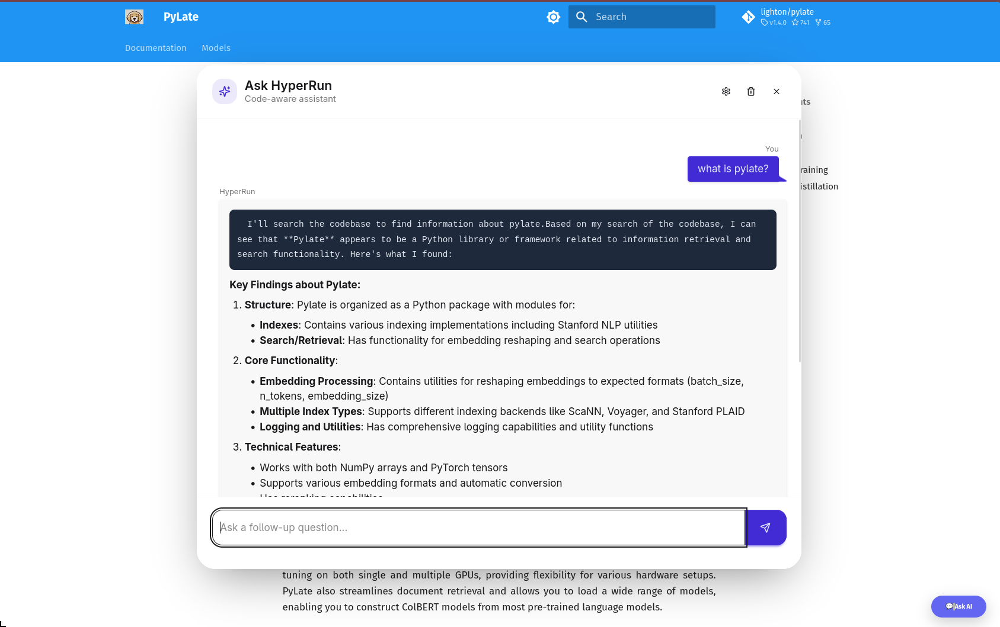

Documentation sites are where developers go for answers, but finding what you need in a large codebase can be frustrating.

RunLLM solved this by adding an "Ask AI" chat widget to docs, letting users ask questions in natural language and get answers grounded in the actual code.

But RunLLM is closed-source and hosted.

If you want control over your data, your models, and your costs — you're out of luck.

- maybe you want to let the user use its own AI model (BYOK)
  - It's better for the user and no cost for you
- Way faster than the RunLLM

>[!note] RunLLM is more than this
>RunLLM is much more than just a chat with your docs.
>I first found it in the Documentation of DSPy, I liked it and i use it multiple times so i am trying to replicate this part only with other features as opensource

HyperRun is my attempt to build an open-source, self-hosted alternative.

It combines ColGrep's semantic code search with LLM chat, and can be embedded in any docs site — Quarto, nbdev, MkDocs, or plain GitHub Pages — with a single line of code.

## What is HyperRun ?

HyperRun lets developers add a semantic code search chat widget to their docs.

Built on [ColGrep](https://github.com/lightonai/colgrep) for indexing, [Lisette](https://lisette.answer.ai) for LLM orchestration, and [FastHTML](https://fastht.ml) for the UI.



### HyperRun Features

- **Semantic code search** — powered by ColGrep's late-interaction retrieval

- **Streaming chat** — SSE-based responses via HTMX

- **Multi-provider** — supports Anthropic, OpenAI, Google and more via LiteLLM

- **BYOK** — users bring their own API key

- **Chat history** — persistent conversations per session

- **Cost tracking** — per-session token cost display

- **DaisyUI styled** — floating widget with chat bubbles and markdown rendering

- **Embeddable** — drop into any static site (Quarto, MkDocs, GitHub Pages) with one snippet

## Why ColGrep

Most coding agents still use `grep` to search codebases.

It works — but it's pure pattern matching.

If you don't know the exact function name, you're stuck guessing.

Semantic search (RAG) solves this but introduces problems:

- Requires remote storage of your code (security concern)

- Needs a separate vector DB service running

- Keeping the index in sync with a fast-moving codebase is hard

ColGrep takes a completely different approach. It's a Rust CLI tool built by LightOn that:

- **Mirrors the grep interface** — agents already know how to use it

- **Runs entirely locally** — no remote storage, no separate API service

- **Uses late-interaction retrieval** (ColBERT-style) via LateOn-Code models — not traditional embeddings
  - We are using their specialized coding retrieval model 17M

- **Supports hybrid queries** — regex filtering first, then semantic ranking on the filtered results

- **Incremental index updates** — only re-indexes changed files, not the whole repo
  - They are using a nice hashing trick 😎
- **Tree-sitter parsing** — extracts functions, classes, signatures, call graphs — not just raw text chunks

The results speak for themselves:

- Won **70% of head-to-head comparisons** against vanilla grep with Claude Code

- Cut token usage by **15.7%** on average

- **56% fewer search operations** needed to find the right code

- Hard conceptual questions (where you describe behavior, not function names) benefit the most

> [!note] Late-interaction vs traditional embeddings

> Traditional embeddings compress an entire code block into a single vector — losing detail.

> Late-interaction models (like ColBERT) keep per-token vectors, so they can do soft matching between query terms and code tokens.

> This is why ColGrep handles "find the function that inserts articles into the database" better than a single-vector approach.

For HyperRun, ColGrep is the retrieval layer — it finds the relevant code semantically, then Lisette sends it to the LLM for a conversational answer.

## How It Works

HyperRun has two sides — the **Doc Author** who sets it up, and the **End User** who asks questions.

### Doc Author Setup

1. Point HyperRun at your codebase via `.env`
2. On startup, ColGrep indexes the repo automatically — `colgrep init` runs if no index exists
3. Add one line to your docs:

```javascript
<script src="https://your-server/embed"></script>
```

That's it. Works with Quarto, nbdev, MkDocs, GitHub Pages — anything that serves HTML.

### What Happens When a User Asks a Question

1. User clicks "💬 Ask AI" → floating chat panel opens
2. User types a question → sent to the server via HTMX
3. Server calls `colgrep` with the query → gets the top matching code snippets
4. Lisette's `AsyncChat` sends the snippets + question to the LLM as a tool call
5. LLM response streams back via SSE → rendered as markdown in the chat bubble

**The LLM never sees your whole codebase — only the relevant snippets ColGrep finds.**
This keeps context small, responses fast, and costs low.

### BYOK

End users can click the ⚙️ settings icon, pick a provider (Anthropic, OpenAI, Google, etc.), enter their own API key, and choose a model — all dynamically populated from LiteLLM.

## What's Next

HyperRun is still early — here's what I'm working on:

- **Citations** — show which code snippets the LLM used to answer, so users can verify

- **GitHub Actions** — auto re-index on push, auto deploy the server — zero manual steps

- **Better nbdev support** — ColGrep struggles with `.ipynb` files, so we index the exported `.py` package for now

- **Secure BYOK** — move API keys from session cookies to server-side encrypted storage

- **Switching embedding models** — let doc authors choose which ColGrep model to use

For a deep dive into the streaming UI architecture, see [HyperRun Deep Dive: FastHTML, HTMX, and SSE](hyperun_fasthtml.html).

If you want to try it or contribute: [github.com/abdelkareemkobo/hyperrun](https://github.com/abdelkareemkobo/hyperrun)
