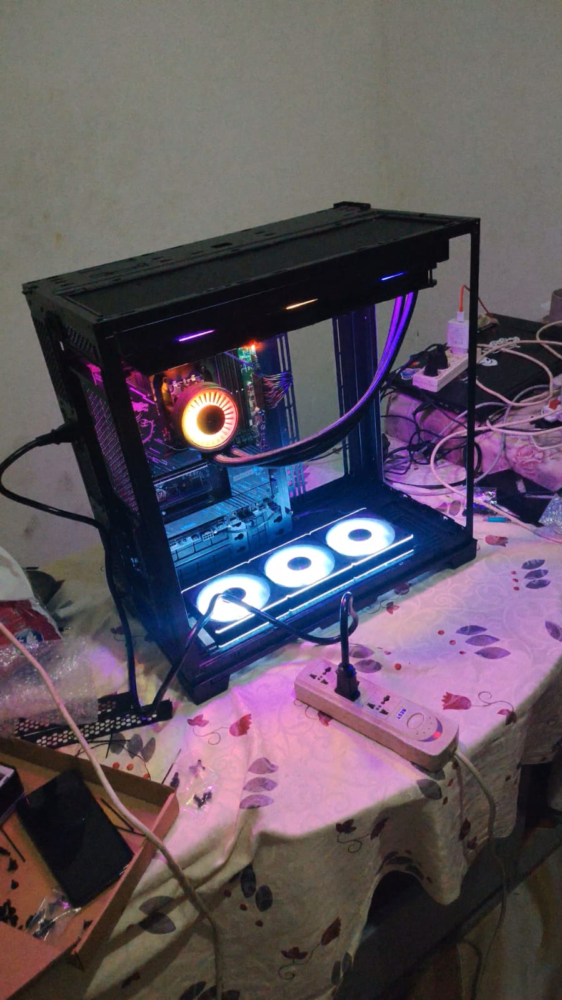
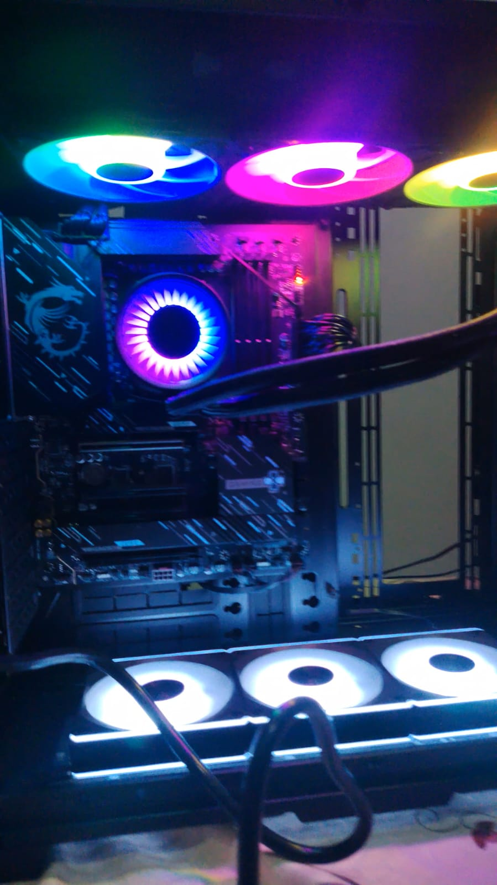
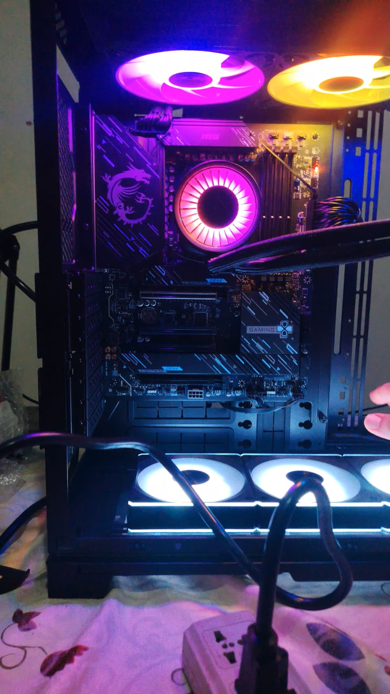
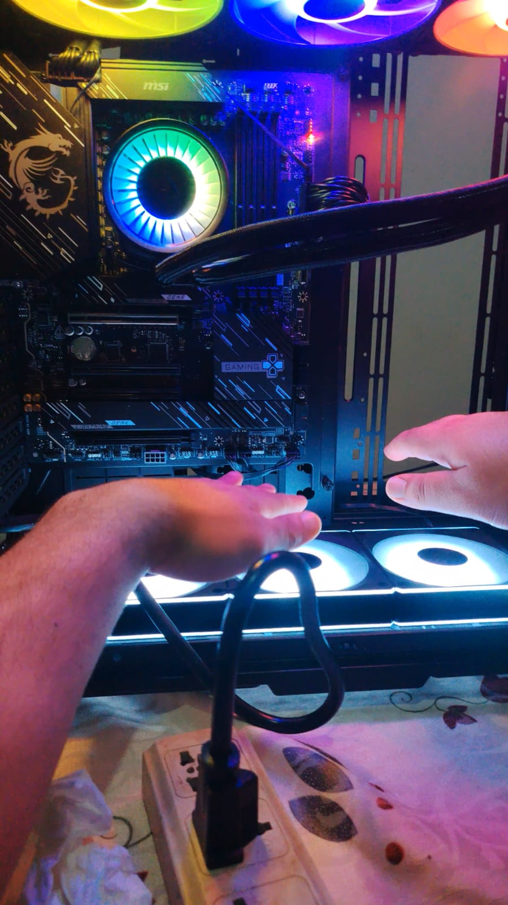

## Why I Am Building a PC for AI Research?

I want to fine-tune many models and learn by practice, but I can't do this easily.
Why?

Because fine-tuning can take a long time, sometimes 7 days or more,
depending on the process.

After 6 months of using dual Titan RTX 48GB GPUs, I found that the minimum
GPU I need to continue my research is at least an RTX 5090.

So I decided to buy one, which is very expensive.

The estimated budget for this build is around 500,000 EGP (around $9,600 USD).

## Why Not Colab or Cloud Providers?

RunPod would cost me around $500 to $900 per month, so in less than a year
I would spend more than $9,600.

Renting an A100 on Colab costs around 10,800 compute units, which is about $1,000.

With cloud solutions, the hardware is also much more limited compared to a
local PC build. Here is a detailed comparison:

| Resource      | Google Colab Pro+            | My Local PC Build                                  |
| ------------- | ---------------------------- | -------------------------------------------------- |
| CPU           | 4 vCPUs, Intel Xeon ~2.2 GHz | AMD Ryzen 9 9950X, 16 cores, 5.7 GHz boost         |
| CPU Threads   | 4 shared threads             | 32 dedicated threads                               |
| RAM           | Up to 52 GB DDR4 ~3200 MT/s  | G.Skill Trident Z5 RGB 32GB DDR5 6400 CL32 (Black) |
| Storage Type  | PCIe SSD (pd-ssd)            | NVMe PCIe 5.0 (AORUS Gen5)                         |
| Storage Speed | ~600 to 800 MB/s read        | up to 12,000 MB/s read                             |
| Storage Size  | ~100 GB                      | 1 TB                                               |
| Session Limit | ~12 hours max                | No limit                                           |

With a local PC, I have no session time limits, no data transfer restrictions,
and full control over my hardware.

The investment pays for itself in less than a year compared to cloud costs.

## Why Local Servers Are Not a Good Option in Egypt?

Building a local server in Egypt comes with some serious challenges.

First, internet bandwidth is limited in Egypt.

AI research requires downloading

large datasets and models, which can be several gigabytes or even terabytes.

This will exhaust your internet subscription very quickly and become very costly.

Second, electricity costs have increased significantly due to the current
economic situation, making it expensive to run power-hungry server hardware
24 hours a day.

Third, there are frequent power outages, especially in summer, which can
interrupt long training runs that may take days to complete.

A personal PC with a UPS (uninterruptible power supply) is a much more
practical and controllable solution for this environment.

## Components I Bought

| Component   | Model                                              |
| ----------- | -------------------------------------------------- |
| CPU         | AMD Ryzen 9 9950X (16 cores, 5.7 GHz boost)        |
| Motherboard | MSI X870 GAMING PLUS WIFI                          |
| CPU Cooler  | ARCTIC Liquid Freezer III Pro 420 A-RGB (White)    |
| RAM         | G.Skill Trident Z5 RGB 32GB DDR5 6400 CL32 (Black) |
| SSD         | GIGABYTE AORUS Gen5 12000 1TB PCIe 5.0 NVMe        |
| PSU         | XPG 1200W                                          |
| Case        | Lian Li O11 Dynamic EVO XL Full Tower              |
| Case Fans   | Lian Li (model TBD)                                |
| GPU         | RTX 5090 Astral (coming soon)                      |

## Before You Start Buying

### Ask a Friend

If you don't know anyone, search online or in your local community.
You will
find many people who are happy to help.

I personally asked three friends:

one I met on Discord, an old college friend, and a younger friend who had
built many PCs before.

He even built mine for me, solved many problems, and
gave me great tips about cable management, electricity, and much more.

### Use AI, But Be Careful

AI tools are very helpful for research, but they tend to recommend popular
and expensive products that rank highly in Google search results.

Instead, get recommendations from friends first, then use AI to understand why they
chose those specific parts.

### Compare Prices Across Multiple Stores

The same component can vary by around 3,000 EGP or more between different
stores. Always check multiple stores before buying.

### Record an Unboxing Video

When you open any product, record a video.

This helps you prove if any pieces are missing when returning or claiming warranty.

### Keep Your Boxes

Do not throw away the original boxes.

You will need them if you have to return, ship, or store any component.

## Stores I Bought From and My Rating

### [El Badr Group](https://elbadrgroupeg.store/) ⭐⭐⭐⭐

The cheapest store I found, with good product selection and warranty coverage.

However, their customer support is very slow and they are often too busy to
respond quickly.

Their website search also needs improvement as their SEO is not strong yet. Despite these issues, the prices make it worth it.

### [Barakh Computer](https://barakacomputer.net/) ⭐⭐⭐⭐⭐

More expensive than El Badr, but they carry premium products and their
customer support is excellent.

Their website is strong and reliable, with only occasional database errors that take some pages temporarily offline.

### [Sigma Computer](http://sigma-computer.com/)⭐

My experience with Sigma was very disappointing.

Their customer support on WhatsApp ignored my questions and only replied the next day. Their website UX is confusing and difficult to navigate.

The support staff was also somewhat rude and unhelpful.

The worst part: I found a product I wanted, they confirmed it was available,
but a few hours later they told me it was out of stock and I had to buy a
different one. Very unprofessional.

## It's Art and Engineering at the Same Time

Building this PC was a truly rewarding journey.

I learned a lot of new concepts along the way and genuinely enjoyed every step of the process.

This post was a quick overview of the experience.

Once I get the RTX 5090, I will share much more detailed content about the actual AI research and
fine-tuning process.

Stay tuned!
[Kareem AI Blog](https://kareemai.com/)
[LiteRT Review](https://kareemai.com/blog/posts/on_device/litert.html)
[HackerRank AI Interview](https://kareemai.com/blog/posts/ml_life/hacker_rank_ai_intereviw.html)
[Vector Databses Book Review](https://kareemai.com/blog/posts/nlp/embedding_world/vector_database_book.html)

