## Why Super Productivity

After 1.5 years of daily use, [Super Productivity](https://super-productivity.com/) has become my only task management system. Not a todo-list, a complete productivity system. And it's free.

### Why It Wins

1. **Free & open source**: no subscriptions, no limits
2. **Cross-platform**: Linux, Windows, Mac, Android, web
3. **Simple to start, deep when you need it**: hidden gems everywhere 💎
4. **Keyboard-first**: fast for power users
5. **No vendor lock-in**: export to JSON or CSV anytime

---

### How I Use It Daily

I use it for development, research, and learning projects.

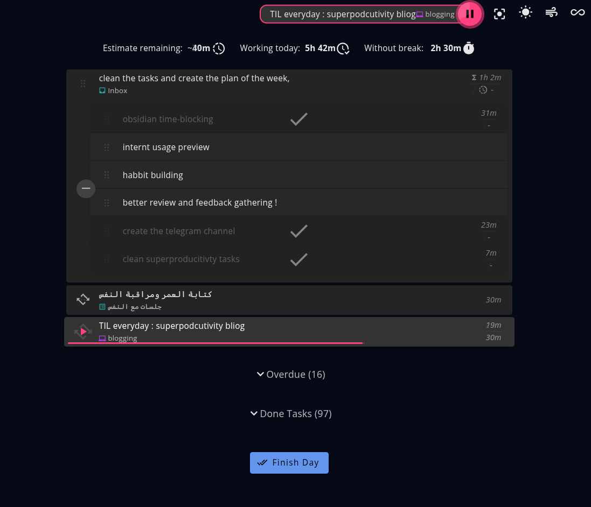

Here's a snapshot of my today tasks:

- Parent tasks show total estimated time
- Subtasks track time individually
- Repeating tasks for daily habits
- Gamified "Finish Day" button celebrates your wins 🎉

### Features I Love

**1. Side Notes**

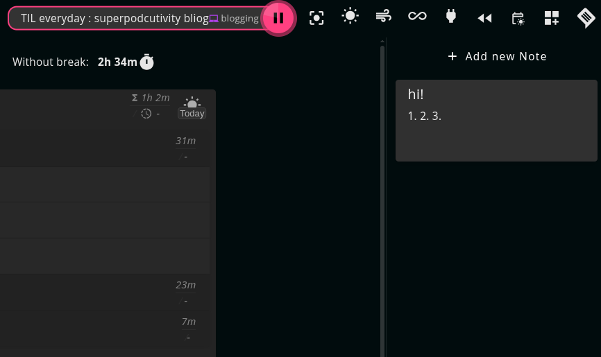

Each project has a notes section. I add my motivation and the end goal here. Seeing the "why" keeps me focused.

**2. Yesterday Review**

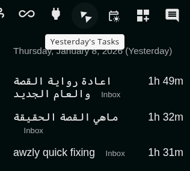

---

**3. Schedule View**

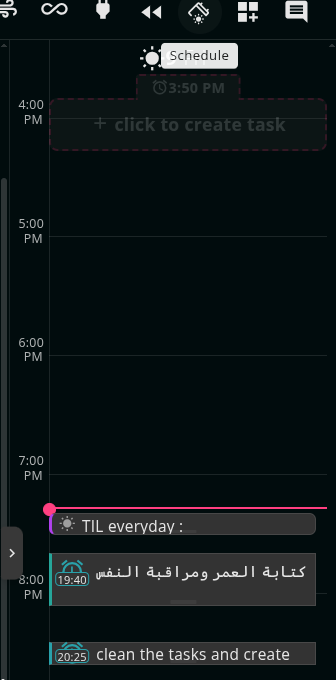

**4. Focus Mode**

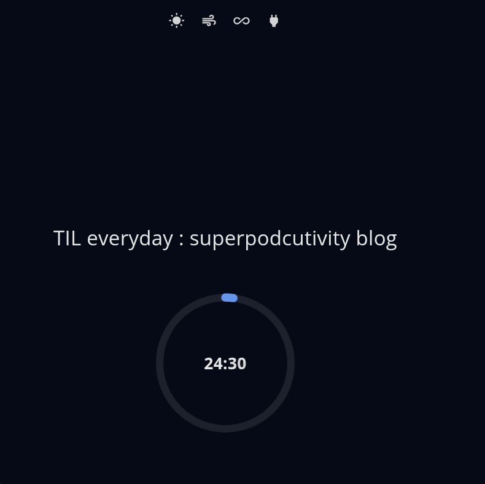

The 4 icons at the top track daily habits with one click.

**5. Project Organization**

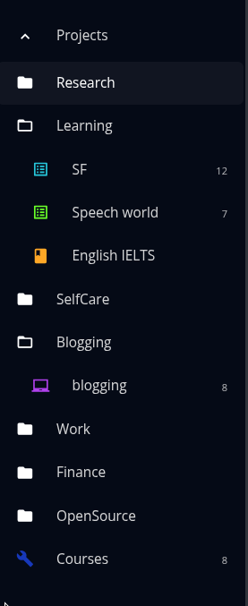

Folders → Projects → Tasks. Clean hierarchy for everything.

**It has also tags but i don't use tags**

### End of Day Flow

When you hit "Finish Day", you get 3 steps:

1. **Review**: summary of what you did

2. **Evaluate**: rate your day
   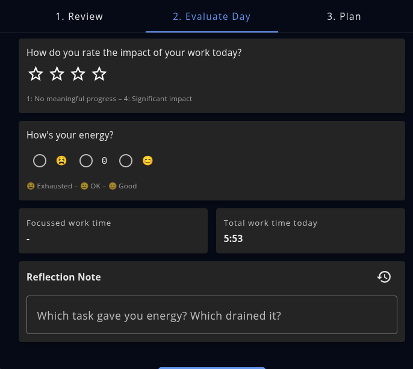

3. **Plan Tomorrow**: set up the next day
   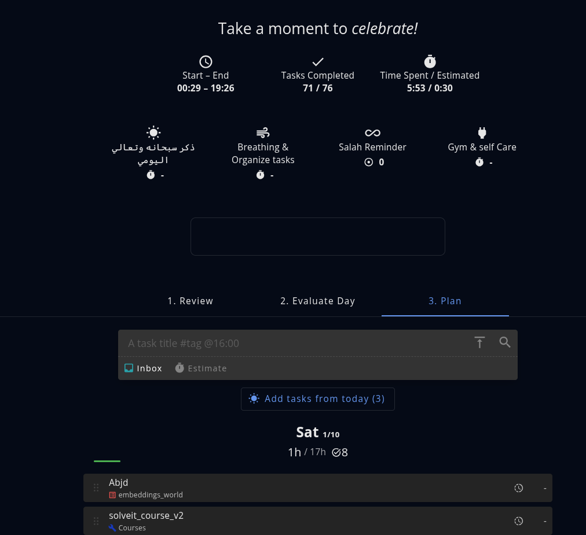

Also includes calendar integration,linear, github..etc!

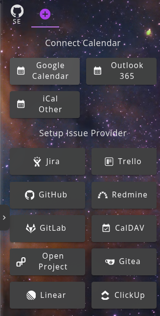

#### markdown support

```md
Task X #blogging 2h @work
```

This is converted into task X with tag blogging and 2 hours estimated in the Project **Work**
very cool.

#### custom backgrounds

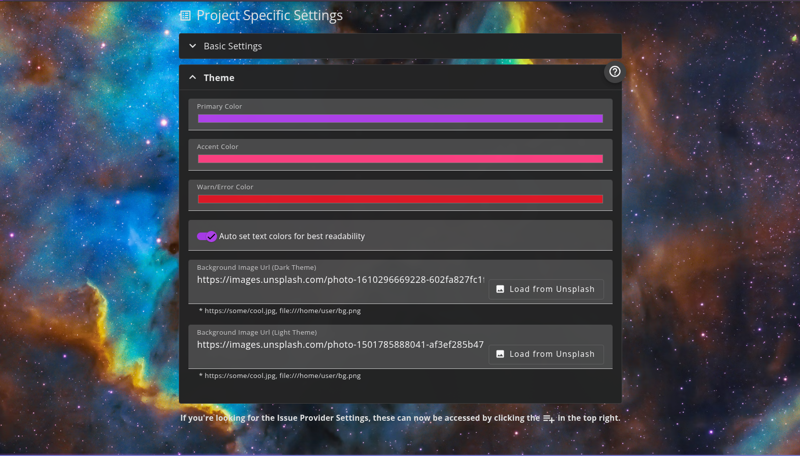

### What I Don't Like

1. **Dated icons**: the icons are old and search for specific one hard
   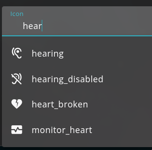
2. **No Gantt chart**: would help for longer projects
3. **Sync conflicts**: when using two devices simultaneously, it asks which data to keep. Apps like TickTick handle this more smoothly. I wish there was smarter merging.

### Final Thoughts

There are features I still haven't explored. The developer responds quickly and respectfully to issues.

Remember this all in a free app without ads, data leakage,...etc!

Give it a try: [super-productivity.com](https://super-productivity.com/)

### More Resources

If you're interested in more tool reviews or my journey in AI, check out these posts:

1. [Getting back to RSS](https://kareemai.com/blog/posts/life_style/back_to_rss.html)
2. [One Plus Pad 3 Review](https://kareemai.com/blog/posts/products_reviews/one_plus_pad_3.html)
3. [Huawei Freebuds 7i Review](https://kareemai.com/blog/posts/products_reviews/Huawei%20freebuds%207i.html)

You can also explore my [Research Papers](../../../papers.qmd) or see my [Open Source Projects](../../../oss/opensource.qmd).
