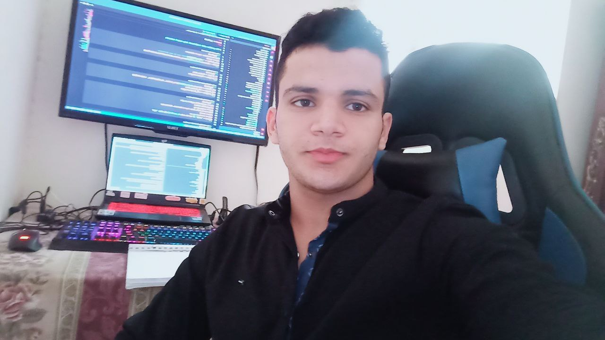

::: {.hero-section}
{.hero-avatar}

::: {.hero-intro}
# Abdelkareem Elkhateb

**Arabic NLP Researcher.**

I make AI models small, fast, and actually useful.
:::

<a href="https://github.com/abdelkareemkobo" class="hero-link">GitHub</a>
<a href="https://scholar.google.com/citations?user=lF1wxvcAAAAJ" class="hero-link">Research</a>
<a href="https://www.upwork.com/freelancers/~017a9fea792423bb9a" class="hero-link primary">Hire me</a>
<a href="https://qabilah.com/profile/kareemai/posts" class="social-btn qabilah" target="_blank">
 Qabilah
</a>
<a href="https://www.linkedin.com/in/abdelkareem-elkhateb-202b6b377/" class="social-btn linkedin" target="_blank">
 LinkedIn
</a>

<a href="https://x.com/AbdelkareemElk1" class="social-btn x" target="_blank">
 X
</a>

:::

<blockquote class="arabic-quote">
اللغة ليست عِلمًا .. بل هي شيء فوق العلم 
لغتنا في خطر داهم .. ونحن أيضًا
"Language is not a science — it is something above science. Our language is in danger — and so are we."
</blockquote>

---

## Who am I

::: {.work-section}

I'm an NLP Engineer at **[Xbites](https://xbites.io)**, building the AI backend for Darin.

I also research with **[Hamza Salem Lab](https://www.enghamzasalem.com/)** on Arabic embeddings and contributer to **[NAMMA](https://www.namaa.space/)** for open-source Arabic AI.

My thesis focuses on making transformers run efficiently on CPUs.

7papers

54citations

962papers read

:::

---

::: {.projects-grid}

## Projects

::: {.project-card .featured}
### BertHash-Femto
113× smaller than AraBERTv2, 94% accuracy. Runs on edge devices.
[→ GitHub](https://github.com/abdelkareemkobo)
:::

::: {.project-card}
### Zarra & Bojji
Tiny Arabic models for phones.
[→ Read more](http://kareemai.com/blog/posts/minishlab/blog_zaraah.html)
:::

::: {.project-card}
### كم كالوري
Arabic nutrition search.
[→ Try it](https://kamcalorie.com)
:::

::: {.project-card}
### GPUVec
GPU pricing & ML benchmarks.
[→ Check it](https://gpuvec.com)
:::

:::

---

::: {.contact-section}
[kareem01095134688@gmail.com](mailto:kareem01095134688@gmail.com) · [Upwork](https://www.upwork.com/freelancers/~016a9fea792423bb9a) · [GitHub](https://github.com/abdelkareemkobo)
:::

::: {.newsletter-box}
<iframe title="Subscribe to my newsletter" src="https://kareemnns.substack.com/embed" width="100%" height="150" style="border:none; background:transparent;" frameborder="0" scrolling="no" loading="lazy"></iframe>
:::

<blockquote class="arabic-quote small">
فقالَ: إن تَصدُقِ اللَّهَ يَصدُقْكَ
</blockquote>
